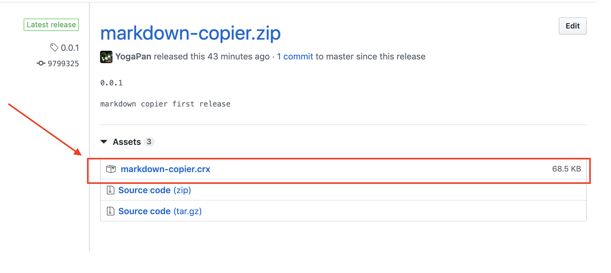
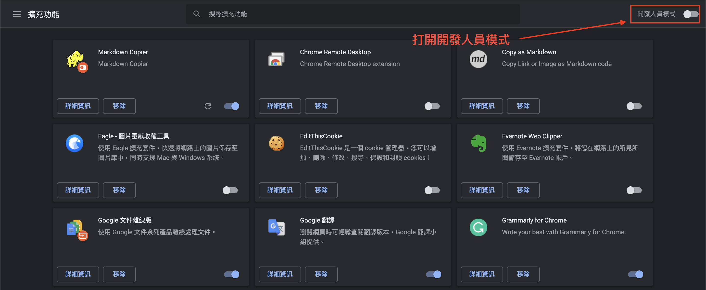

# Markdown Copier

## Installation

### Manually Install

Step 1: Download [crx file](https://github.com/YogaPan/markdown-copier/releases):

Step 2: goto chrome://extensions/ and load crx file

Step 3: Reload Web Page

### Chrome Web Store

TODO

## Usage

1. right click link

2. click extension icon

3. shortcut `Command + Shift + L` for Mac, `Ctrl + Shift + L` for Windows

## Contribution

TODO
